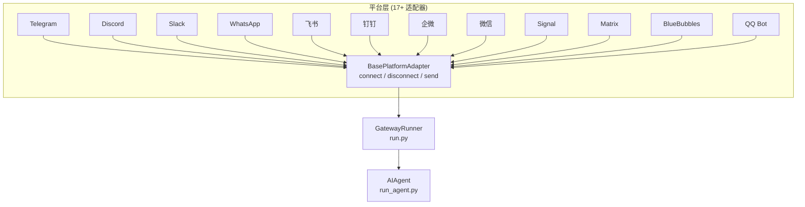
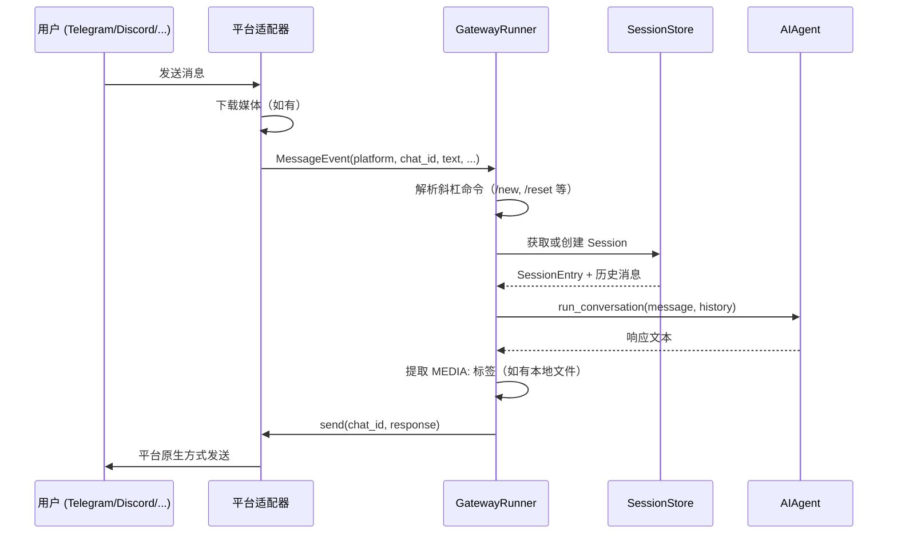
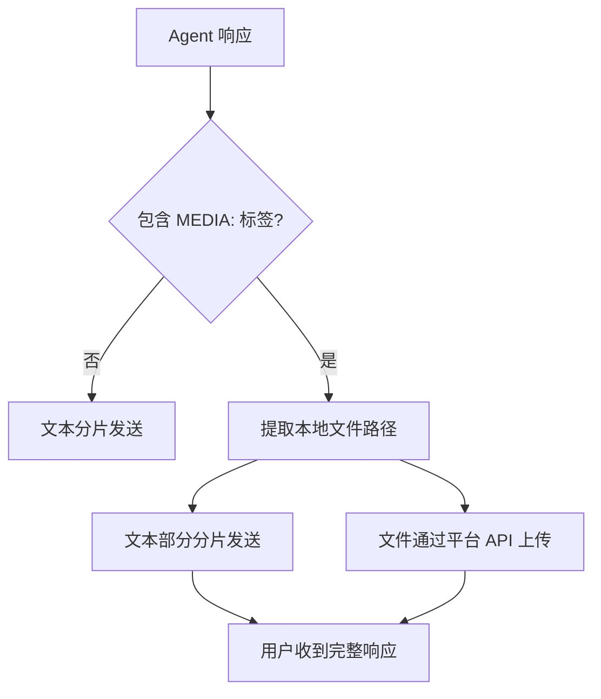
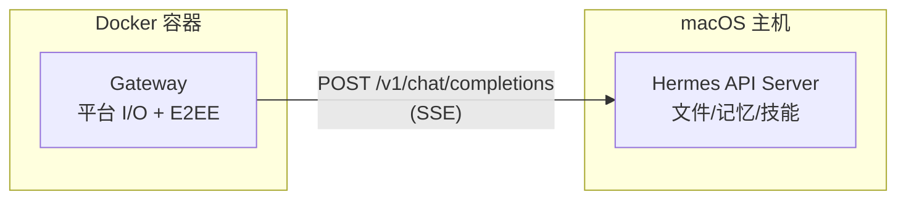

## 4.1 网关架构

Hermes Gateway 不是简单的"Telegram Bot 封装"。它是一个统一的协议适配层，把 17 种消息平台的协议差异收敛到同一个 `MessageEvent → AIAgent → SendResult` 流程中。理解这三层架构，是后续接入任何平台的基础。

---

### 4.1.1 平台适配器模式

#### 核心思路：一个 ABC，十七种实现

所有平台适配器都继承自 `BasePlatformAdapter`（`gateway/platforms/base.py`），必须实现三个方法：

```python
class BasePlatformAdapter(ABC):
    @abstractmethod
    async def connect(self) -> bool:
        """连接平台并开始接收消息"""

    @abstractmethod
    async def disconnect(self) -> None:
        """断开连接"""

    @abstractmethod
    async def send(self, chat_id: str, content: str, ...) -> SendResult:
        """发送消息"""
```

这意味着添加一个新平台只需要实现三个方法——连接、断开、发送。其余功能（如打字指示器 `send_typing()`、文件上传 `send_file()`、消息编辑 `edit_message()`）都有合理的默认空实现，平台可以按需覆盖。



#### 源码结构

```
gateway/
├── run.py              # 主循环、斜杠命令分发（7600+ 行）
├── session.py          # SessionStore — 对话持久化
├── delivery.py         # 消息投递与分片
├── config.py           # 网关配置解析
├── hooks.py            # 事件钩子（Gateway Hooks）
├── pairing.py          # DM 配对（跨平台用户关联）
├── status.py           # 状态管理
├── mirror.py           # 跨平台消息镜像
├── stream_consumer.py  # 流式输出消费
└── platforms/          # 17 个平台适配器
    ├── base.py         # BasePlatformAdapter ABC
    ├── telegram.py
    ├── discord.py
    ├── slack.py
    ├── whatsapp.py
    ├── feishu.py
    ├── dingtalk.py
    ├── wecom.py
    ├── weixin.py
    ├── signal.py
    ├── matrix.py
    ├── mattermost.py
    ├── bluebubbles.py
    ├── qq.py
    ├── homeassistant.py
    ├── webhook.py
    ├── api_server.py
    └── email.py
```

#### 消息处理主流程

一条消息从用户发送到 Agent 回复，经过以下步骤：



**关键设计决策**：

1. **统一入口**：不管消息来自哪个平台，都经过同一个 `process_event()` 方法，确保所有平台享受相同的斜杠命令、会话管理和安全策略。

2. **平台无关的 Agent**：AIAgent 不需要知道消息来自 Telegram 还是 Discord——它只处理纯文本和工具调用。平台差异（如 Telegram 的 Markdown 解析、Discord 的 embed）全部在适配器层处理。

3. **并发安全**：每个 session 有独立的 `_quick_key`（由 `platform + user_id + chat_id` 组成），不同 session 的 agent 在独立线程中并行执行，互不阻塞。

---

### 4.1.2 会话管理

#### 为什么会话管理是网关的核心问题

在终端中使用 Hermes，对话天然是连续的——你的终端窗口就是会话。但在消息平台上：

- 用户可能关闭应用几小时后再回来
- 同一个群里有多个用户在和 Agent 对话
- 你在 Telegram 和 Discord 上都连了 Agent，它们应该共享记忆但保持对话独立

Gateway Session（`gateway/session.py`）解决这些问题。

#### SessionKey：会话的唯一标识

每个会话由 `SessionKey` 唯一标识，构建规则如下：

```python
# DM 私聊
agent:main:{platform}:dm:{chat_id}

# DM 私聊 + 线程（Telegram 话题、Discord Thread）
agent:main:{platform}:dm:{chat_id}:{thread_id}

# 群组（默认按用户隔离，每人独立对话）
agent:main:{platform}:group:{chat_id}:{user_id}

# 群组（共享模式，所有人同一对话）
agent:main:{platform}:group:{chat_id}

# 线程（默认共享）
agent:main:{platform}:thread:{chat_id}:{thread_id}
```

配置隔离策略：

```yaml
# config.yaml
gateway:
  group_sessions_per_user: true    # 群组中每个用户独立会话（默认）
  thread_sessions_per_user: false  # 线程中共享会话（默认）
```

| 场景 | 默认行为 | 配置切换 |
|------|---------|---------|
| DM 私聊 | 按聊天隔离 | 不可改 |
| 群组 | 按用户隔离 | `group_sessions_per_user: false` → 共享 |
| 线程 | 共享 | `thread_sessions_per_user: true` → 按用户隔离 |

#### 会话重置策略

长时间运行的网关需要自动清理过期会话，避免内存膨胀和上下文溢出：

```yaml
# config.yaml
gateway:
  reset_policy:
    dm: idle:24h        # DM 24 小时无活动重置
    group: daily        # 群组每日重置
    thread: idle:12h    # 线程 12 小时无活动重置
```

当会话过期后，用户发消息时会收到提示：

```
⚠️ Previous session expired (idle for 24h). Starting fresh conversation.
```

过期时 Agent 的记忆（memory）会自动 flush 到持久存储，不会丢失。

#### PII 脱敏

Gateway 对用户 ID 和聊天 ID 进行自动哈希脱敏（Discord 除外，因为需要真实 ID 来 @ 用户）：

```python
# 脱敏前：telegram:123456789
# 脱敏后：telegram:a1b2c3d4e5f6
```

这确保 Agent 在处理消息时不会看到用户的真实平台 ID，同时保持标识的唯一性。

#### Agent 运行中收到新消息

当同一个会话的 Agent 正在执行时，用户发新消息的处理逻辑：

| 消息类型 | 处理方式 | 说明 |
|---------|---------|------|
| `/stop` | 硬中断 | 立即停止当前 Agent |
| `/reset` `/new` | 中断 + 重置 | 停止当前 + 清空会话 |
| `/queue <text>` | 排队 | 等当前轮次结束后作为下一轮输入 |
| `/status` | 不打断 | 直接返回当前状态 |
| `/model` | 拒绝 | 提示"Agent 正在运行，先 /stop" |
| 照片 | 排队合并 | 多张照片自动合并到同一个 pending event |
| 普通文本 | 软中断 | interrupt() + 文本追加到 pending |

不同聊天窗口或不同用户的请求，通过独立线程完全并行，互不影响。

---

### 4.1.3 消息投递机制

#### 三段式消息投递

Agent 的响应可能很长（超过平台的单条消息限制），也可能包含本地文件（图片、PDF）。Gateway 的投递层（`gateway/delivery.py`）处理这些问题：

**文本分片**：当响应超过平台限制（Telegram 4096 字符、Discord 2000 字符）时，自动按段落/代码块边界分片发送。

**媒体提取**：Agent 响应中的 `MEDIA:/path/to/file` 标签会被自动提取，通过平台原生方式发送（Telegram sendDocument、Discord attachment 等）。



#### 流式输出

Gateway 支持流式输出（Streaming），Agent 生成响应时逐 chunk 发送给用户，而不是等全部生成完毕。这在长回复场景下大幅改善用户体验。

流式输出通过 `GatewayStreamConsumer` 实现，它会：
1. 收集 Agent 的流式输出 chunk
2. 按平台支持的频率更新消息（Telegram editMessage、Discord webhook edit）
3. 最终确认消息内容

#### Proxy Mode（薄中继模式）

特殊场景下，Gateway 和 Agent 可以分开运行：



适用场景：你想用 Matrix E2EE（需要 Docker 里跑），但 Agent 本身需要访问 macOS 本地文件。

启用方式：

```yaml
# config.yaml
gateway:
  proxy_url: "http://host.docker.internal:8080"
```

或环境变量：

```bash
GATEWAY_PROXY_URL=http://host.docker.internal:8080
GATEWAY_PROXY_KEY=<与上游 API_SERVER_KEY 匹配>
```

#### 斜杠命令一览

Gateway 在所有平台上共享一套斜杠命令：

| 命令 | 功能 |
|------|------|
| `/new` | 新建对话 |
| `/reset` | 重置当前会话 |
| `/model [provider:model]` | 切换模型 |
| `/personality [name]` | 设置人格 |
| `/retry` | 重试上一轮 |
| `/undo` | 撤销上一轮 |
| `/compress` | 手动压缩上下文 |
| `/usage` | 查看 Token 使用量 |
| `/insights [days]` | 使用洞察 |
| `/skills` | 浏览已安装技能 |
| `/stop` | 中断当前工作 |
| `/status` | 平台连接状态 |
| `/sethome` | 设置主平台 |
| `/platforms` | 查看所有已连接平台 |
| `/restart` | 重启网关（管理员） |

这些命令在 Telegram、Discord、Slack、飞书等所有平台上表现一致——输入 `/` 即可看到命令列表（在支持命令补全的平台上）。
