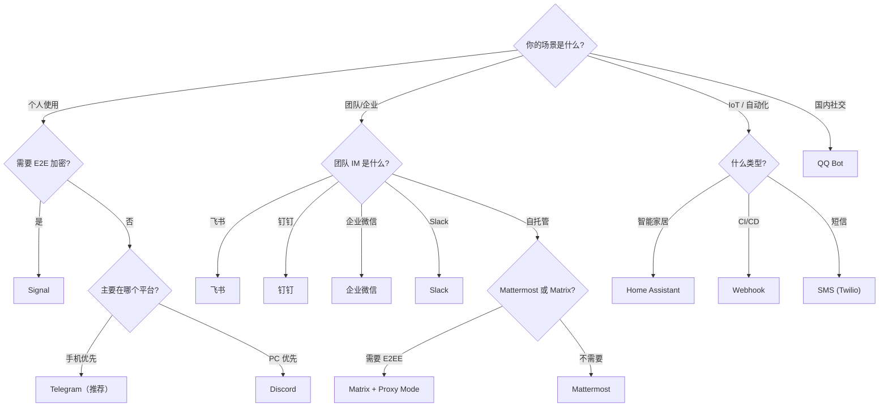

## 4.4 其他平台

除了前面介绍的核心平台和企业平台，Hermes 还支持多种长尾平台。这些平台的用户量较小，但在特定场景下不可替代——比如 Signal 的 E2E 加密、Matrix 的去中心化、QQ Bot 的国内生态。

---

### 4.4.1 Signal

Signal 提供端到端加密消息，适合对隐私要求极高的场景。

#### 接入方式

Signal 通过 `signal-cli` JSON RPC 模式接入，需要在服务器上先注册一个 Signal 号码：

```bash
# 安装 signal-cli（需要 Java）
# 注册号码
signal-cli -u +1234567890 register
signal-cli -u +1234567890 verify <验证码>

# 启动 JSON RPC 模式
signal-cli -u +1234567890 daemon --socket /tmp/signal.sock
```

#### 配置 Hermes

```yaml
# config.yaml
signal:
  socket_path: "/tmp/signal.sock"    # Unix socket 路径
  phone_number: "+1234567890"
```

#### 特性

- 端到端加密（依赖 signal-cli 管理 E2EE 密钥）
- 支持私聊和群聊
- 支持媒体消息

> **注意**：Signal 的 SessionSource 使用 UUID 作为用户 ID（`user_id_alt` 字段）和群内部 ID（`chat_id_alt` 字段），与其他平台的数字 ID 格式不同。Gateway Session 层已经统一抽象了这种差异。

---

### 4.4.2 SMS（Twilio）

通过 Twilio API 收发短信，适合给没有智能手机的用户或 IoT 场景。

#### 配置

```yaml
# config.yaml
sms:
  provider: "twilio"
  account_sid: "ACxxxxxxxxxxxxxxxxxxxxxxxxxxxxxxxx"
  auth_token: "xxxxxxxxxxxxxxxxxxxxxxxxxxxxxxxx"
  from_number: "+1234567890"
```

需要配置一个公网可访问的 Webhook URL，供 Twilio 回调。可以使用 ngrok 等工具做内网穿透：

```bash
ngrok http 8080
# 将 ngrok URL 配置到 Twilio Console 的 Messaging Webhook
```

#### 限制

- 单条 SMS 限制 160 字符（GSM 7-bit）或 70 字符（Unicode）。Hermes 会自动分段但体验受限
- 不支持图片、文件等媒体
- 费用按条计算

**建议**：SMS 仅作为补充通道，不适合作为主要交互方式。

---

### 4.4.3 Email（IMAP/SMTP）

通过邮件与 Agent 交互，适合需要正式沟通留痕的场景。

#### 配置

```yaml
# config.yaml
email:
  imap_host: "imap.gmail.com"
  imap_port: 993
  smtp_host: "smtp.gmail.com"
  smtp_port: 587
  username: "agent@example.com"
  password: "app-specific-password"    # Gmail 需要应用专用密码
  poll_interval: 30    # 每 30 秒检查一次新邮件
```

#### 特性

- 支持收发邮件
- 附件会被提取并交给 Agent 处理
- Agent 回复会以邮件形式发送

> **推荐**：Hermes 也提供了 `himalaya` CLI 技能来管理邮件，支持更细粒度的邮件操作（搜索、标记、移动等）。详见 `himalaya` 技能文档。

---

### 4.4.4 Matrix

Matrix 是一个去中心化的开源消息协议，支持 E2E 加密。

#### 接入方式

通过 `matrix-nio` Python 库连接：

```yaml
# config.yaml
matrix:
  homeserver: "https://matrix.org"
  user_id: "@hermes-bot:matrix.org"
  password: "xxxxxxxx"
  # 或使用 access_token
  access_token: "syt_..."
```

#### 特性

- **E2E 加密**：需要持久化加密密钥。推荐使用 Docker 运行 Gateway 来保证密钥安全
- 去中心化：可以连接任何 Matrix homeserver
- 支持私聊和房间（群聊）

#### Proxy Mode 典型场景

Matrix E2EE 需要持久化密钥，适合在 Docker 中运行；但 Agent 需要访问本地文件系统。这时可以使用 Proxy Mode：

```yaml
# Docker 中的 config.yaml
gateway:
  proxy_url: "http://host.docker.internal:8080"
  proxy_key: "my-secret-key"
```

```
Matrix 用户 ←→ Gateway (Docker, E2EE 密钥)
                     │ POST /v1/chat/completions (SSE)
                     ↓
               Hermes API Server (macOS 主机)
                     ↓
              本地文件、记忆、技能
```

---

### 4.4.5 Mattermost

Mattermost 是 Slack 的自托管替代品，适合数据不能出内网的团队。

#### 配置

```yaml
# config.yaml
mattermost:
  url: "https://mattermost.example.com"
  token: "xxxxxxxxxxxxxxxxxxxxxxxxxxxxxxxx"
  team: "engineering"
```

与 Slack 类似，支持频道和 Thread。也支持 `channel_prompts` 按频道定制提示。

---

### 4.4.6 QQ Bot

QQ Bot 通过官方 API v2 接入，支持 C2C 私聊、群聊、频道和 DM。

#### 接入方式

QQ Bot 使用 WebSocket 入站接收消息，REST API 出站发送：

```yaml
# config.yaml
qq:
  app_id: "xxxxxxxxxx"
  app_secret: "xxxxxxxxxxxxxxxxxxxxxxxx"
```

#### 特性

- **语音转录**：使用腾讯 ASR 服务自动转录语音消息
- **Allowlist + DM 配对**：控制谁能使用 bot，以及私聊消息关联
- 支持多种消息类型：C2C 私聊、群聊、频道、DM

---

### 4.4.7 BlueBubbles（iMessage）

BlueBubbles 是 iMessage 的开源桥接方案，允许在非 macOS 设备上使用 iMessage。需要一台 macOS 机器运行 BlueBubbles Server。

#### 配置

```yaml
# config.yaml
bluebubbles:
  server_url: "http://mac-server:1234"
  password: "xxxxxxxx"
```

#### 特性

- REST + Webhook 双向通信
- 支持 Tapback（消息表情回应）
- 支持已读回执
- 需要始终运行的 macOS 设备

---

### 4.4.8 Webhook

Webhook 是一个通用事件接收器，允许任何 HTTP 客户端向 Hermes 发送消息。

#### 配置

```yaml
# config.yaml
webhook:
  secret: "my-webhook-secret"    # 验证请求来源
  port: 8080
```

#### 使用场景

- CI/CD 流水线通知 Agent 构建结果
- 监控系统告警转发给 Agent 处理
- 自定义工具通过 HTTP 触发 Agent 任务

发送消息示例：

```bash
curl -X POST http://localhost:8080/webhook \
  -H "Authorization: Bearer my-webhook-secret" \
  -H "Content-Type: application/json" \
  -d '{"text": "Build #123 failed. Check logs.", "chat_id": "default"}'
```

---

### 4.4.9 Home Assistant

Home Assistant 通过 WebSocket 连接，将 Agent 变成智能家居的语音/文字控制入口。

#### 配置

```yaml
# config.yaml
homeassistant:
  url: "http://homeassistant.local:8123"
  token: "eyJ0eXAiOiJKV1Qi..."
```

#### 使用场景

- 监控设备状态变化
- 通过对话控制设备（"把客厅灯关了"）
- 触发自动化流程
- 接收告警通知

Agent 通过 `homeassistant` toolset 访问 Home Assistant 的设备控制 API。

---

### 平台选择决策树


