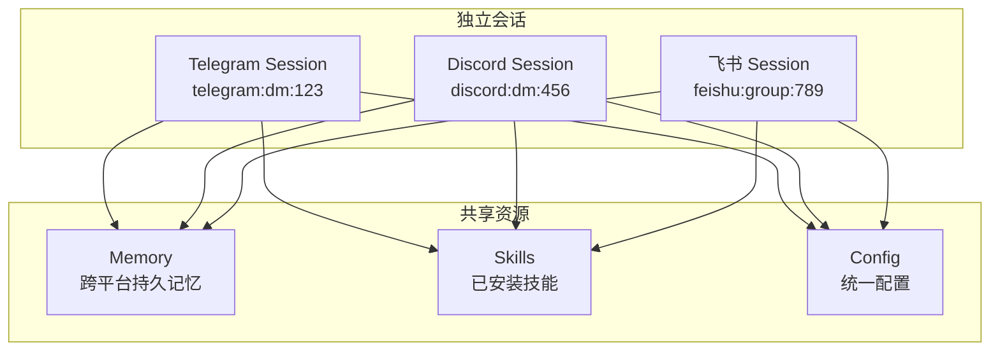

## 4.5 跨平台功能

当你接入了多个平台后，Hermes 提供了一系列跨平台能力，让多平台体验从"多个独立 Bot"升级为"一个 Agent 的多个入口"。

---

### 4.5.1 `/platforms` 状态查看

在任何已连接的平台上发送 `/platforms`，查看当前所有平台的连接状态：

```
/platforms

Connected Platforms:
  ✓ telegram    (DM with @yourname)
  ✓ discord     (Server: MyServer)
  ✓ feishu      (Group: 产品讨论群)
  ✗ slack       (disconnected — token expired)
```

这帮助你快速确认哪些平台正常工作、哪些需要排查。

---

### 4.5.2 `/sethome` 设置主平台

主平台（Home Platform）是 Agent 在需要主动通知你时的首选通道——比如 Cron 定时任务完成、长时间任务的结果通知等。

```
/sethome telegram
```

设置后，Agent 的定时任务（Cron）、后台任务完成通知等默认发送到 Telegram。

Cron 任务投递选项：

```
"deliver" 参数:
- "origin"  → 回到触发任务的那个聊天窗口
- "local"   → 仅保存到本地文件
- "telegram" → 发送到 Home Platform（Telegram）
```

---

### 4.5.3 会话同步

Hermes 的会话是按 `platform:chat_type:chat_id` 隔离的。这意味着：

- 你在 Telegram 的对话和 Discord 的对话是**独立的**
- 但它们共享同一套 **Memory（记忆）** 和 **Skills（技能）**



**实际效果**：

你在 Telegram 上告诉 Agent "我喜欢简洁的回答"，这条偏好会被写入 Memory。之后你在 Discord 上和 Agent 对话时，它也会知道"这个用户喜欢简洁的回答"——因为记忆是跨平台共享的。

但两边的**对话上下文**是独立的——Telegram 上的多轮对话不会污染 Discord 的上下文窗口。

---

### 4.5.4 统一指令集

所有平台共享同一套斜杠命令：

| 命令 | 功能 | 说明 |
|------|------|------|
| `/new` | 新建对话 | 清空当前会话上下文 |
| `/reset` | 重置会话 | 同 `/new`，但在某些平台会发送确认消息 |
| `/model` | 切换模型 | `/model anthropic:claude-sonnet-4` |
| `/personality` | 设置人格 | `/personality concise` |
| `/retry` | 重试上一轮 | 用相同输入重新生成 |
| `/undo` | 撤销上一轮 | 删除最后一轮对话 |
| `/compress` | 压缩上下文 | 手动触发上下文压缩 |
| `/usage` | Token 用量 | 显示当前会话的 token 消耗 |
| `/insights` | 使用洞察 | `/insights 7` 显示 7 天使用统计 |
| `/skills` | 浏览技能 | 列出已安装技能 |
| `/stop` | 中断当前工作 | 立即停止 Agent 正在执行的任务 |
| `/status` | 平台状态 | 显示当前平台的连接信息 |
| `/platforms` | 所有平台 | 显示所有已连接平台状态 |
| `/sethome` | 设置主平台 | `/sethome telegram` |
| `/restart` | 重启网关 | 管理员命令，重启 Gateway 进程 |
| `/queue` | 排队消息 | Agent 忙碌时将消息排队 |

**平台差异**：

- **Telegram**：命令通过 BotCommand 菜单展示，输入 `/` 自动补全
- **Discord**：命令注册为原生 Slash Commands，出现在命令选择器中
- **Slack**：命令映射为 `/hermes <subcommand>`
- **飞书/钉钉**：命令作为普通消息解析，输入 `/new` 即可
- **插件命令**：通过 `register_command()` 注册的插件命令会在所有平台上自动暴露

---

### 4.5.5 DM 配对

DM 配对（`gateway/pairing.py`）用于关联不同平台上的同一用户。当你在多个平台上使用 Hermes 时，配对可以确保：

- Memory 中的用户画像跨平台一致
- `/sethome` 投递路由能正确工作
- 使用洞察（`/insights`）能汇总所有平台的使用数据

配对通过 `GATEWAY_ALLOWED_USERS` 环境变量中的用户 ID 列表实现：

```bash
GATEWAY_ALLOWED_USERS=telegram:123456789,discord:987654321
```

未授权用户发送消息时，机器人静默忽略（不会提示"你没有权限"，避免信息泄露）。
