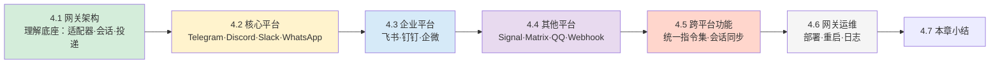

## 第四章：消息网关

### 章节引言

前几章你已经学会了安装 Hermes、配置模型、在终端里和 Agent 对话。但一个只能坐在终端里的助手，能力再强也受限于"谁在看屏幕"。

当你希望：

- 在手机上通过 Telegram 和 Agent 随时对话
- 在团队 Slack 频道里让所有成员共享 Agent 能力
- 让 Agent 持续运行，不需要你保持终端连接
- 同时接入多个平台，所有对话共享同一套记忆和技能

你需要的就是 **Gateway**——Hermes 的统一消息网关。

**学习目标：**

- 理解 Gateway 的三层架构：平台适配器 → 会话管理 → 消息投递
- 掌握 Telegram、Discord、Slack、WhatsApp 等核心平台的接入方法
- 完成飞书、钉钉、企业微信等企业平台的配置
- 了解 Signal、Matrix、QQ Bot 等长尾平台的接入差异
- 学会跨平台会话同步与统一指令集的使用
- 掌握网关的部署、运维与日志排障

**前置知识：** 假设你已经完成了前几章的安装配置，理解 `config.yaml` 的基本结构和 API Key 的配置方法。

**学完本章，你将能够：** 将 Hermes Agent 部署为一个 7×24 运行的多平台智能助手，同时服务 Telegram 私聊、Discord 服务器、飞书群组等多个入口。

---

### 全景导览

本章七个节围绕"把 Agent 投射到消息平台"展开，层层递进：

简而言之：4.1 是原理，4.2-4.4 是各平台实战，4.5 是跨平台能力，4.6 是运维闭环。

### 本章内容导读

- **[4.1 网关架构](4.1_gateway_arch.md)**：平台适配器模式、会话管理、消息投递机制的完整拆解
- **[4.2 核心平台接入](4.2_core_platforms.md)**：Telegram Bot、Discord Bot、Slack Bot、WhatsApp 的配置与接入实战
- **[4.3 企业平台](4.3_enterprise_platforms.md)**：飞书、钉钉、企业微信/微信的配置要点与企业场景注意事项
- **[4.4 其他平台](4.4_other_platforms.md)**：Signal/SMS/Email、Matrix/Mattermost、QQ Bot/BlueBubbles、Webhook/Home Assistant
- **[4.5 跨平台功能](4.5_cross_platform.md)**：`/platforms` 状态查看、`/sethome` 主平台、会话同步、统一指令集
- **[4.6 网关运维](4.6_ops.md)**：`hermes gateway start/stop`、`/restart`、日志监控
- **[4.7 本章小结](4.7_summary.md)**：关键结论与自检清单
