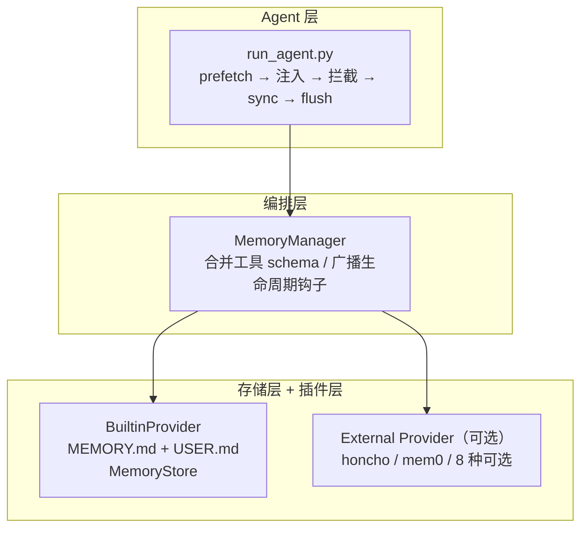
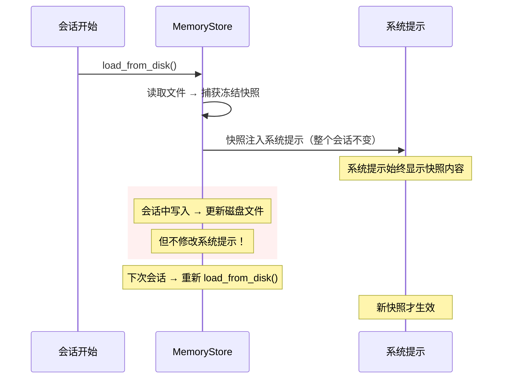
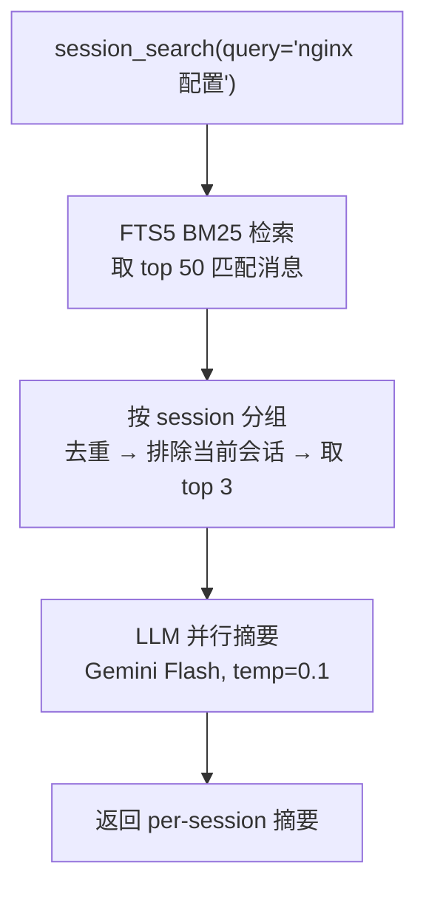
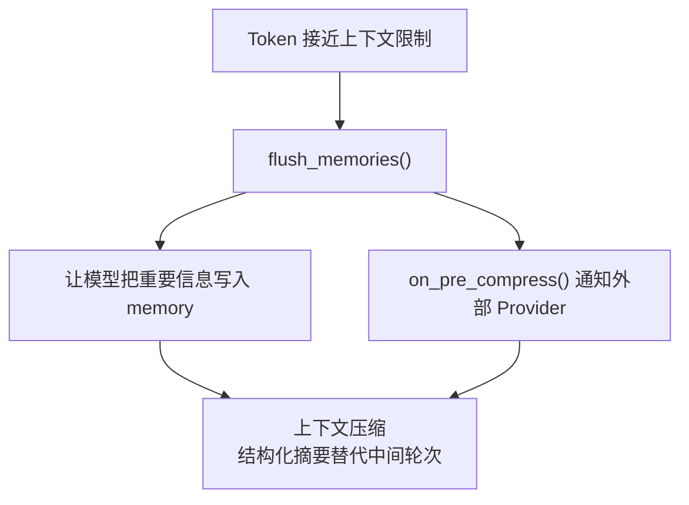

## 5.1 记忆系统

Hermes 的记忆系统不是简单的"保存对话历史"。它是一个精心设计的三层架构，解决一个核心问题：**如何在有限的 token 预算内，让 Agent 拥有跨会话的持久记忆？**

---

### 5.1.1 架构概览：三层设计



| 层 | 文件 | 职责 |
|----|------|------|
| 存储层 | `tools/memory_tool.py` (561行) | 双文件存储、冻结快照、原子写入、安全扫描 |
| 编排层 | `agent/memory_manager.py` (367行) | 合并多个 Provider、工具路由、生命周期广播 |
| 插件层 | `agent/memory_provider.py` (232行) | MemoryProvider ABC，8 个可选外部 Provider |

---

### 5.1.2 MemoryStore：双文件存储

Memory 使用两个文件存储不同类型的信息：

| 文件 | 内容 | 默认上限 | 路径 |
|------|------|---------|------|
| `MEMORY.md` | Agent 的个人笔记：环境事实、项目约定、工具特性 | 2,200 字符 | `~/.hermes/memories/MEMORY.md` |
| `USER.md` | 用户画像：偏好、沟通风格、期望 | 1,375 字符 | `~/.hermes/memories/USER.md` |

条目之间用 `§`（section sign）分隔，支持多行条目。

#### 启用记忆

```yaml
# config.yaml
memory:
  memory_enabled: true           # 启用 MEMORY.md（默认 false）
  user_profile_enabled: true     # 启用 USER.md（默认 false）
  memory_char_limit: 2200        # 字符上限（可调）
  user_char_limit: 1375
```

> **注意**：Memory 默认是关闭的。你需要在 `config.yaml` 中显式启用。

#### 系统提示中的呈现

当 Memory 启用后，系统提示中会出现这样的区块：

```
════════════════════════════════════════════════════
MEMORY (your personal notes) [65% — 1,430/2,200 chars]
════════════════════════════════════════════════════
服务器是 Ubuntu 22.04，Python 3.11
§
用户偏好使用中文交流
§
patch 工具使用模糊匹配，minor whitespace 差异不会破坏它
```

```
════════════════════════════════════════════════════
USER PROFILE (who the user is) [16% — 227/1,375 chars]
════════════════════════════════════════════════════
GitHub: username Lunar-feedmob
喜欢简洁回答，不要废话
```

---

### 5.1.3 冻结快照：为什么写入后当前会话看不到？

这是 Memory 系统最关键的设计决策：



**为什么要这样设计？**

系统提示的稳定性直接影响 Anthropic 的 Prefix Cache 命中率。如果每次写入 Memory 都更新系统提示，前缀缓存就会失效，每轮的 API 调用成本会显著增加。

**那当前会话怎么知道写入了什么？**

通过工具返回值兜底。每次 `memory(action="add/replace/remove")` 的返回值包含**实时的全部条目**：

```json
{
  "success": true,
  "entries": ["条目1", "条目2", "刚新增的条目3"],
  "usage": "65% — 1,430/2,200 chars",
  "entry_count": 3
}
```

模型在对话上下文中能看到最新内容，不需要系统提示更新。

---

### 5.1.4 memory 工具

Agent 通过 `memory` 工具管理记忆，三个操作：

#### add — 添加条目

```python
memory(
    action="add",
    target="memory",        # "memory" → MEMORY.md, "user" → USER.md
    content="PyMuPDF 只装在系统 Python 3.12 中，需要用 subprocess 调用"
)
```

#### replace — 替换条目

```python
memory(
    action="replace",
    target="memory",
    old_text="服务器是 Ubuntu 20.04",   # 匹配旧条目中的子串
    content="服务器已升级到 Ubuntu 24.04"
)
```

#### remove — 删除条目

```python
memory(
    action="remove",
    target="memory",
    old_text="过时的条目内容"
)
```

#### 字符限制策略

Memory 不是数据库——它是**精心策展的小卡片盒**。当空间不足时，不会自动淘汰，而是返回错误让模型自行管理空间：

```json
{
  "success": false,
  "error": "Memory at 2,100/2,200 chars. Adding this entry (200 chars) would exceed the limit. Replace or remove existing entries first.",
  "current_entries": ["条目1", "条目2", "条目3"],
  "usage": "2,100/2,200"
}
```

**设计意图**：限制空间逼模型做策展——过时的 replace、不重要的 remove、新发现的 add。

#### 安全扫描

所有写入内容经过 12 种威胁模式检测 + 不可见 Unicode 字符检测：

| 威胁类别 | 示例 |
|---------|------|
| 提示注入 | `ignore previous instructions` |
| 角色劫持 | `you are now...` |
| 信息隐藏 | `do not tell the user` |
| 密钥泄露 | `curl ... $TOKEN` |
| SSH 后门 | `authorized_keys` |
| 持久化攻击 | `crontab` |

检测到威胁时写入会被阻止，返回错误信息。

---

### 5.1.5 session_search：跨会话对话回忆

Memory 存储稳定事实（~3500 字符），但大量历史信息需要另一个机制。`session_search` 通过 SQLite FTS5 全文搜索 + LLM 摘要实现跨会话对话回忆。

#### 两种模式

**模式 1：浏览最近会话**（无 query，零 LLM 成本）

```python
session_search()
# 返回最近的会话标题、预览、时间戳
```

**模式 2：关键词搜索**（有 query）

```python
session_search(query="nginx 配置")
```

搜索流程：



#### 搜索语法

```python
# OR 连接（推荐，FTS5 默认 AND 会漏结果）
session_search(query="elevenlabs OR baseten OR funding")

# 精确短语
session_search(query='"docker networking"')

# 排除
session_search(query="python NOT java")

# 前缀匹配
session_search(query="deploy*")
```

> **技巧**：用 OR 连接关键词效果最好。FTS5 默认 AND 会漏掉只提到部分关键词的会话。

#### Memory vs Session Search

| 维度 | Memory | Session Search |
|------|--------|---------------|
| 存什么 | 持久事实、偏好 | 完整对话历史 |
| 容量 | ~3,500 字符 | 无限（SQLite） |
| 检索方式 | 每轮自动注入系统提示 | 按需 FTS5 搜索 + LLM 摘要 |
| 写入方 | LLM 主动调用 memory 工具 | 自动（每轮对话自动持久化） |
| 读取成本 | 零（在系统提示里） | FTS5 查询 + LLM 摘要调用 |
| 适用场景 | "用户喜欢中文" | "上次我们怎么配 nginx 的？" |

#### Session 数据自动清理

长期运行后 SessionDB 可能膨胀。Hermes 在启动时自动执行 `maybe_auto_prune_and_vacuum()`：

- 默认清理 90 天以上的已结束 session
- 清理后自动 VACUUM 压缩数据库
- 跨进程共享锁，防止并发清理

一个重度用户报告：384MB/982 sessions → prune + VACUUM 后降到 43MB。

---

### 5.1.6 MemoryProvider 插件

除了内置的文件存储，Hermes 支持外部 Memory Provider 作为扩展：

```yaml
# config.yaml
memory:
  provider: honcho    # 启用 Honcho AI 辩证式用户建模
```

#### 可用的 8 个 Provider

| Provider | 特点 |
|----------|------|
| honcho | Honcho AI 辩证式用户建模 |
| mem0 | Mem0 记忆管理 |
| hindsight | Hindsight 回溯记忆 |
| holographic | Holographic 全息记忆 |
| openviking | OpenViking 记忆 |
| retaindb | RetainDB 持久记忆 |
| supermemory | SuperMemory 超级记忆 |
| byterover | ByteRover 记忆 |

#### 约束

- **至多一个外部 Provider**：`add_provider()` 会拒绝第二个非 builtin provider
- 内置 Provider 始终存在，外部 Provider 是可选的增强
- 两者共享生命周期钩子（prefetch、sync、flush），失败隔离（一个 Provider 崩溃不影响另一个）

#### 内置 Memory 写入镜像

当 Agent 调用 `memory(action="add", ...)` 时：

1. **内置 Provider** 写入 `MEMORY.md` / `USER.md`（本地文件）
2. `on_memory_write()` **通知外部 Provider**
3. 外部 Provider 可以将此事实同步到自己的后端

这保证了即使使用外部 Provider，本地文件始终是最新的。

---

### 5.1.7 上下文压缩与 Memory Flush

当对话接近模型上下文限制时，Context Compressor 会触发。在压缩前，有一个关键步骤：**Memory Flush**。



压缩算法（v3）包含三个阶段：

1. **Phase 1**（零成本本地操作）：MD5 去重 + Smart Collapse（工具输出替换为信息化的单行摘要）+ tool_call 参数截断
2. **Phase 2**：确定边界，保护头部（系统提示 + 首轮）和尾部
3. **Phase 3**：LLM 结构化摘要（action-log 风格：编号的 Completed Actions + Active State）

压缩后的摘要使用 v3 模板：

```
## Goal
## Constraints & Preferences
## Completed Actions
1. READ config.py:45 — found bug [tool: read_file]
2. PATCH config.py:45 — fixed [tool: patch]
## Active State
## In Progress
## Blocked
## Key Decisions
## Remaining Work
## Critical Context
```

---

### 5.1.8 后台 Memory Review

系统每 10 轮（可配置）自动触发一次后台 review，审视对话历史，提取值得持久化的事实：

```yaml
# config.yaml
memory:
  nudge_interval: 10    # 每 10 轮触发一次后台 review（0 = 禁用）
```

Review Agent 以独立的线程运行，不阻塞主对话。它可以自动调用 `memory` 工具添加或更新条目。

与 Skill Review 合并：当 memory review 和 skill review 同时触发时，使用合并 prompt 一次处理，节省 LLM 调用。
