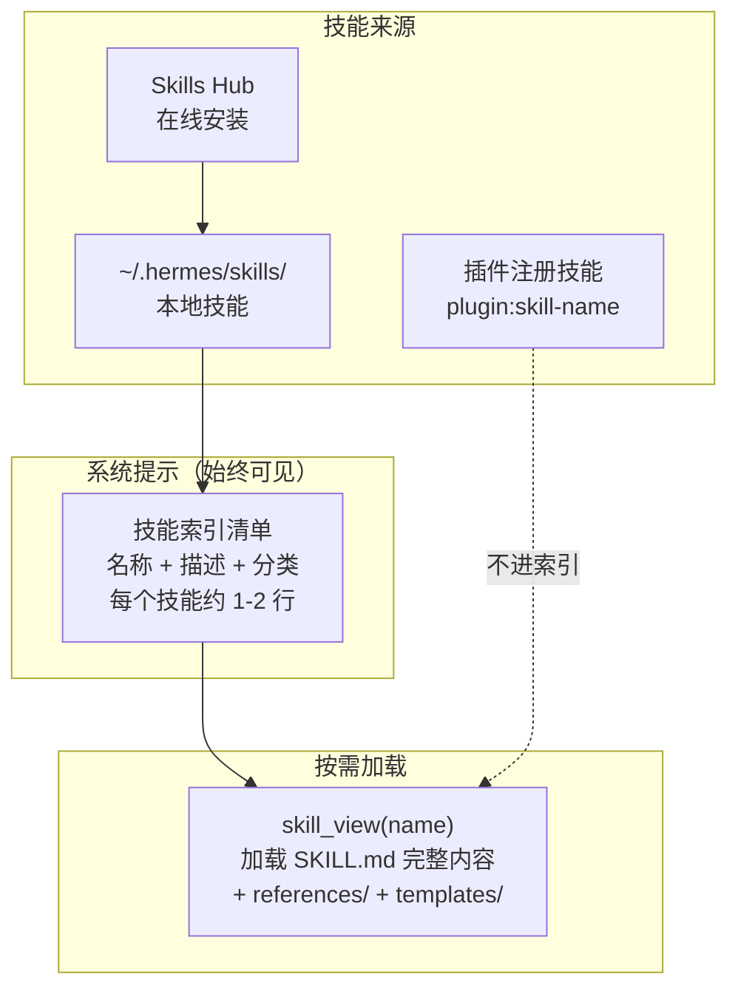
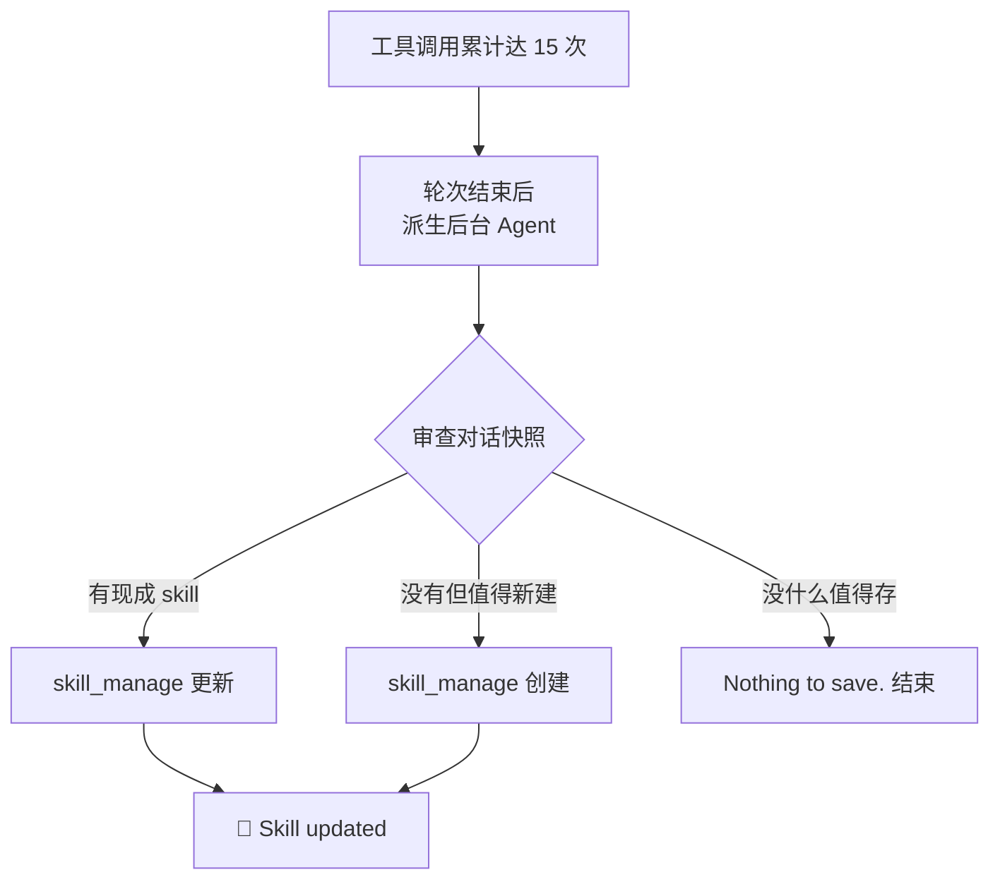
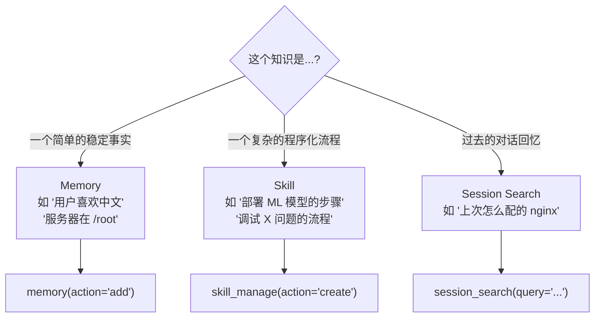

## 5.2 Skills Hub

如果说 Memory 是 Agent 的"短期笔记本"（有限空间、精心策展），那 Skills 就是 Agent 的"可复用工具箱"——详细的程序化知识，按需加载，无限容量。

Hermes 的技能系统灵感来自 Anthropic 的 Claude Skills，核心理念是 **渐进式披露（Progressive Disclosure）**：平时只保留轻量元数据在系统提示中，只在需要时加载完整指令。

---

### 5.2.1 技能架构



| 组件 | 文件 | 职责 |
|------|------|------|
| 工具层 | `tools/skills_tool.py` (1378行) | `skills_list` 和 `skill_view` 两个工具 |
| Prompt 构建层 | `agent/prompt_builder.py` | 扫描技能目录，构建索引注入系统提示 |
| 管理工具 | `tools/skill_manager_tool.py` | 创建、编辑、删除技能 |
| Hub | `tools/skills_hub.py` | 在线搜索和安装技能 |
| 安全 | `tools/skills_guard.py` | 100+ 正则模式安全扫描 |

---

### 5.2.2 SKILL.md 格式

每个技能是一个目录，核心是 `SKILL.md` 文件：

```
~/.hermes/skills/
├── my-skill/
│   ├── SKILL.md              # 主指令文件（必需）
│   ├── references/           # 支持文档
│   │   ├── api.md
│   │   └── examples.md
│   ├── templates/            # 输出模板
│   │   └── config.yaml
│   ├── scripts/              # 脚本文件
│   │   └── validate.py
│   └── assets/               # 补充文件
└── category/                 # 分类子目录
    └── another-skill/
        └── SKILL.md
```

#### SKILL.md 的完整格式

```yaml
---
name: deploy-ml-model                    # 必需，最多 64 字符
description: Deploy ML models to production using vLLM  # 必需
version: 1.0.0                           # 可选
license: MIT                             # 可选
platforms: [linux]                       # 可选，限制 OS 平台
prerequisites:                           # 可选，运行时要求
  env_vars: [VLLM_API_KEY]              #   需要的环境变量
  commands: [curl, jq]                  #   需要的命令
setup:                                   # 可选，交互式设置向导
  help: "Get API key at https://..."
  collect_secrets:
    - env_var: VLLM_API_KEY
      prompt: "Enter your vLLM API key"
      secret: true
metadata:                                # 可选
  hermes:
    tags: [mlops, deployment, llm]
    related_skills: [gguf-quantization, serving-llms-vllm]
---

# Deploy ML Model

## 概述
本技能提供将 ML 模型部署到生产环境的完整工作流...

## 步骤

### 1. 环境检查
...

### 2. 模型量化
...

## 常见问题
...

## 参考链接
- [vLLM Documentation](https://...)
```

#### YAML Frontmatter 字段说明

| 字段 | 必需 | 说明 |
|------|------|------|
| `name` | 是 | 技能唯一标识，小写字母+数字+连字符，最多 64 字符 |
| `description` | 是 | 简要描述，最多 1024 字符，会出现在系统提示的技能索引中 |
| `version` | 否 | 语义版本号 |
| `platforms` | 否 | 限制 OS：`macos`、`linux`、`windows` |
| `prerequisites.env_vars` | 否 | 需要预设的环境变量 |
| `prerequisites.commands` | 否 | 需要已安装的命令 |
| `setup.collect_secrets` | 否 | 交互式密钥收集配置 |

---

### 5.2.3 `/skills` 浏览与安装

#### 浏览已安装技能

在任何平台上发送 `/skills` 命令，或在对话中让 Agent 使用 `skills_list` 工具：

```
/skills

Available Skills:
  deploy-ml-model     — Deploy ML models to production using vLLM
  docker-network-debug — Debug Docker networking issues
  fine-tuning-with-trl — Fine-tune LLMs using TRL

Categories: mlops (3), devops (1)
```

#### 查看技能详情

```python
skill_view(name="deploy-ml-model")
# 返回完整的 SKILL.md 内容
```

如果技能有 `references/` 或 `templates/` 目录：

```python
skill_view(name="deploy-ml-model", file_path="references/api.md")
# 返回特定引用文件的内容
```

#### 安装技能

从 Skills Hub（在线仓库）安装：

```python
# 搜索技能
skills_hub_search(query="docker deployment")

# 安装技能
skills_hub_install(name="docker-deploy")
```

从 GitHub 安装：

```bash
hermes skill install https://github.com/user/skill-repo
```

#### 安全扫描

所有技能在安装前会经过 **100+ 正则模式** 的安全扫描：

| 扫描类别 | 示例 |
|---------|------|
| 数据泄露 | `curl $TOKEN`、`os.getenv("SECRET")` |
| 提示注入 | `ignore previous instructions` |
| 破坏性操作 | `rm -rf /`、`shutil.rmtree('/')` |
| 持久化后门 | `crontab`、`authorized_keys` |
| 网络后门 | `nc -l`、`ngrok` |
| 混淆执行 | `base64 -d | bash` |
| 供应链攻击 | `curl | sh`、未锁定版本的 `pip install` |
| 不可见 Unicode | 零宽空格、RTL 覆盖等 17 个字符 |

#### 信任级别

扫描结果会给出裁决（safe / caution / dangerous），然后根据技能来源决定安装策略：

| 来源 | safe | caution | dangerous |
|------|------|---------|-----------|
| builtin（内置） | allow | allow | allow |
| trusted（官方） | allow | allow | block |
| community（社区） | allow | **block** | block |
| agent-created（Agent 创建） | allow | allow | **ask** |

---

### 5.2.4 自定义技能

#### 手动创建

创建目录和 SKILL.md：

```bash
mkdir -p ~/.hermes/skills/my-custom-skill
```

然后编辑 `~/.hermes/skills/my-custom-skill/SKILL.md`：

```yaml
---
name: my-custom-skill
description: My custom workflow for ...
---

# My Custom Skill

## 步骤

### 1. 第一步
具体指令...

### 2. 第二步
具体指令...

## 注意事项
...
```

#### 让 Agent 创建

直接告诉 Agent：

```
帮我创建一个技能，记录我们刚才调试 Docker 网络问题的完整步骤
```

Agent 会调用 `skill_manage(action="create", ...)` 自动创建。

#### 编辑现有技能

```python
skill_manage(
    action="patch",
    name="my-custom-skill",
    old_string="旧的步骤描述",
    new_string="更新后的步骤描述"
)
```

---

### 5.2.5 条件激活

技能不是始终显示的——它们可以根据当前环境条件性激活：

| 条件 | 说明 |
|------|------|
| `requires_tools` | 只有当特定工具可用时才显示 |
| `requires_toolsets` | 只有当特定工具集可用时才显示 |
| `fallback_for_tools` | 当主工具可用时隐藏（作为备选） |
| `fallback_for_toolsets` | 当主工具集可用时隐藏 |
| `platforms` | 限制特定 OS 平台 |

在 SKILL.md 的 frontmatter 中配置：

```yaml
---
name: fine-tuning-with-trl
description: Fine-tune LLMs using TRL
metadata:
  hermes:
    requires_toolsets: ["terminal", "file"]
    requires_tools: ["terminal"]
    platforms: [linux]
---
```

**效果**：在 Windows 上或没有 `terminal` 工具的环境中，这个技能不会出现在技能索引中。

---

### 5.2.6 自动 Skill Review

与 Memory Review 类似，Hermes 会自动审视对话，提取可复用的程序化知识。

#### 触发条件

```yaml
# config.yaml
skills:
  creation_nudge_interval: 15   # 每累计 15 次工具调用触发一次 review（0 = 禁用）
```

三个条件同时满足时触发：
1. 功能未禁用（`creation_nudge_interval > 0`）
2. 工具调用累计达标（跨轮次持续累加）
3. `skill_manage` 工具在当前环境中可用

#### 执行流程



**设计特点**：

- **不阻塞用户**：在回复用户之后才启动
- **不修改主对话**：后台 Agent 独立运行
- **共享记忆存储**：后台 Agent 与主 Agent 共享 `_memory_store`
- **与 Memory Review 可合并**：同时触发时使用合并 prompt 一次处理

---

### 5.2.7 插件命名空间技能

插件可以注册带命名空间的技能，避免与内置技能重名冲突：

```python
# 插件的 __init__.py
def register(ctx):
    ctx.register_skill(
        name="deploy",
        path=Path(__file__).parent / "skills" / "deploy" / "SKILL.md",
        description="Deploy a service to production",
    )
```

实际名字是 `myops:deploy`（`插件名:技能名`）。

**关键区别**：插件技能**不出现在**系统提示的技能索引中。Agent 必须知道名字才能调用 `skill_view("myops:deploy")`。

这样设计的原因：
- 避免插件污染主提示词
- 避免第三方插件数量波动导致 prefix cache 失效
- Agent 不应该自动感知用户安装的所有插件

---

### 5.2.8 Memory vs Skills 决策树

当你（或 Agent）犹豫"这个信息应该存到哪里"时：



**维护优先级**：Memory > Skills > Session Search

- **Memory** 最重要——每轮都注入，直接影响行为
- **Skills** 次之——按需加载，但影响复杂任务质量
- **Session Search** 最后——用于回忆上下文，不是核心行为

---

### 5.2.9 密钥管理

技能可以声明需要的环境变量，系统会自动管理：

```yaml
# SKILL.md frontmatter
setup:
  collect_secrets:
    - env_var: VLLM_API_KEY
      prompt: "Enter your vLLM API key"
      secret: true
```

当技能首次使用时：
1. 检查 `~/.hermes/.env` 是否已设置
2. CLI 模式：通过交互式提示收集
3. Gateway 模式：提示用户手动配置
4. 保存后持久化到 `.env` 文件
