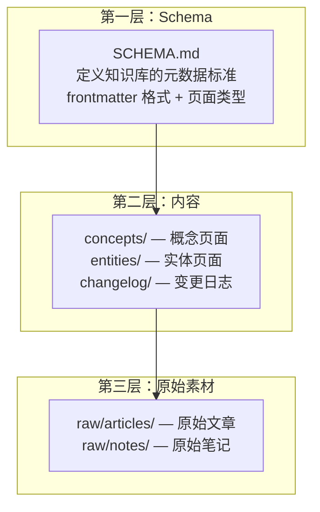

## 5.3 LMWiki 知识库

Memory 和 Skills 解决了"Agent 自己的记忆和技能"的问题。但当你需要 Agent 掌握一个完整领域的知识——比如一个代码库的架构、一个研究领域的论文、一个项目的完整设计文档——你需要的是 **LMWiki 知识库**。

LMWiki（LLM-Wiki）灵感来自 Andrej Karpathy 的理念：让 LLM 维护一个结构化的知识库，而不是依赖 RAG（检索增强生成）。

---

### 5.3.1 Karpathy 理念 vs RAG

| 维度 | RAG（检索增强生成） | LMWiki（LLM 维护知识库） |
|------|-------------------|------------------------|
| 知识存储 | 向量数据库，按嵌入检索 | Markdown 文件，按目录结构组织 |
| 知识质量 | 原始文档片段，可能有噪声 | 经过 LLM 整理的结构化文档 |
| 更新方式 | 索引自动更新 | LLM 主动编辑和策展 |
| 检索精度 | 依赖嵌入质量，可能遗漏 | 目录结构明确，精确查找 |
| 维护成本 | 低（自动化） | 高（需要 LLM 主动策展） |
| 适用场景 | 大量非结构化文档 | 精心策展的知识体系 |

**核心理念**：LMWiki 不是搜索引擎，而是一个**活的百科全书**——Agent 既是读者也是作者，持续整理和更新知识。

---

### 5.3.2 三层架构

一个 LMWiki 知识库由三层组成：



#### SCHEMA.md

每个知识库的根目录需要一个 `SCHEMA.md`，定义：

```yaml
---
name: my-knowledge-base
description: My structured knowledge base
version: 1.0
page_types:
  concept:
    required_fields: [title, created, type]
    optional_fields: [updated, tags, sources]
  entity:
    required_fields: [title, created, type]
    optional_fields: [updated, tags, url]
  changelog:
    required_fields: [title, created, type]
    optional_fields: [updated]
---
```

#### 页面结构

每个页面使用 YAML frontmatter + Markdown body：

```yaml
---
title: 页面标题
created: 2026-04-24
updated: 2026-04-24
type: concept
tags: [tag1, tag2]
sources: [source1, source2]
---

# 页面标题

## 概述
...

## 详细内容
...

## 相关页面
- [[other-page]] — 关联说明
```

`[[]]` 是 Obsidian 风格的双链语法，支持页面间的交叉引用。

---

### 5.3.3 Ingest-Query-Lint 工作流

LMWiki 的日常使用围绕三个核心操作：

#### Ingest（摄入）

将外部素材转化为知识库页面：

```
用户提供 URL / PDF / 文章
        ↓
Agent 读取并理解内容
        ↓
提取关键概念和实体
        ↓
生成符合 SCHEMA.md 的页面
        ↓
写入对应目录（concepts/、entities/）
        ↓
更新 index.md 目录
```

Agent 可以自动执行这个过程。你只需要说"把这篇文章加入知识库"，Agent 会：
1. 读取文章内容
2. 识别关键概念
3. 生成页面并写入
4. 更新索引

#### Query（查询）

从知识库中检索信息：

```
用户提问
    ↓
Agent 扫描 index.md 找到相关页面
    ↓
读取页面内容（read_file / search_files）
    ↓
结合页面内容回答问题
```

与 Memory 不同，LMWiki 的查询是显式的——Agent 需要主动读取文件，而不是自动注入。

#### Lint（检查）

确保知识库的健康状态：

```
运行 lint 检查
    ↓
扫描所有页面的 frontmatter
    ↓
检查：
  - 必填字段是否完整
  - 双链引用是否有效
  - 孤立页面（没有被任何页面引用）
  - 文件命名规范
    ↓
输出检查报告
    ↓
Agent 自动修复或标记问题
```

一个简单的 lint 脚本示例：

```python
import os
import re
import yaml

def lint_wiki(wiki_path):
    issues = []
    # 检查 frontmatter 完整性
    # 检查双链有效性
    # 检查孤立页面
    return issues
```

---

### 5.3.4 Obsidian 集成

LMWiki 天然兼容 Obsidian——一个流行的 Markdown 知识管理工具：

#### 为什么选择 Obsidian

- **本地优先**：知识库就是本地文件，不依赖云服务
- **双链语法**：`[[page-name]]` 原生支持
- **图谱视图**：可视化页面间的关系
- **插件生态**：丰富的社区插件

#### 配置 Obsidian 打开知识库

```bash
# 1. 创建知识库
mkdir -p ~/my-wiki

# 2. 用 Obsidian 打开
# 在 Obsidian 中选择 "Open folder as vault" → 选择 ~/my-wiki
```

#### Obsidian Headless 同步

Hermes 可以在命令行中操作 Obsidian 知识库，无需打开 Obsidian GUI：

```bash
# 通过 hermes-obsidian 技能
hermes obsidian search "概念名"
hermes obsidian backlinks "页面名"
hermes obsidian graph-stats
```

这利用了 Obsidian 的底层文件格式（纯 Markdown），无需 Obsidian 运行。

---

### 5.3.5 最佳实践

#### 知识库规模

| 规模 | 页面数 | 建议 |
|------|--------|------|
| 小型 | 10-50 | 单目录即可，不需要分类子目录 |
| 中型 | 50-200 | 使用 `concepts/`、`entities/`、`changelog/` 分类 |
| 大型 | 200+ | 增加子分类（如 `concepts/mlops/`、`concepts/devops/`） |

#### 页面写作原则

1. **每个页面一个主题**：不要把多个概念塞进一个页面
2. **frontmatter 完整**：至少包含 `title`、`created`、`type`
3. **使用双链**：`[[other-page]]` 建立页面间的关联
4. **定期 lint**：保持知识库健康
5. **changelog 记录重大更新**：帮助追踪知识库的演进

#### 与 Memory 的分工

| 知识类型 | 存储位置 | 原因 |
|---------|---------|------|
| 用户偏好、环境事实 | Memory | 需要每轮注入，快速访问 |
| 复杂工作流 | Skills | 按需加载完整指令 |
| 领域知识、项目文档 | LMWiki | 结构化存储，按需查询 |
| 过去对话回忆 | Session Search | FTS5 全文搜索 |

#### Git 版本控制

强烈建议将知识库纳入 Git 管理：

```bash
cd ~/my-wiki
git init
git add .
git commit -m "Initial wiki structure"
```

这样：
- 每次修改都有历史记录
- 可以通过 Git 同步到 Obsidian（手机/多设备）
- 可以推送到 GitHub 做备份

```bash
# .gitignore 建议
.gitignore
*.tmp
.DS_Store
.obsidian/
```
