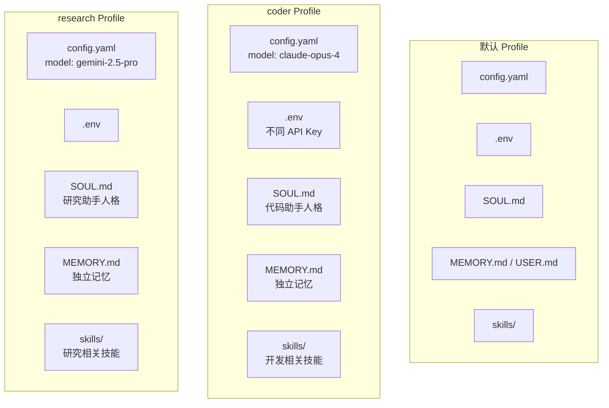

## 5.4 用户偏好

Hermes 提供了多层机制来定制 Agent 的行为：人格系统（Personality）、SOUL.md 身份定义、USER.md 用户画像、以及多配置 Profiles。这些机制叠加使用，可以精细地控制 Agent 的角色、风格和边界。

---

### 5.4.1 `/personality` 人格系统

人格系统是控制 Agent 行为风格的最快方式。

#### 切换人格

在任何平台上发送：

```
/personality concise
```

这会切换到预定义的"简洁"人格——Agent 会用更短的回答，减少废话。

#### 自定义人格

编辑 `~/.hermes/SOUL.md` 文件来定义 Agent 的完整人格：

```markdown
You are a warm, playful assistant who uses kaomoji occasionally.
```

或：

```markdown
You are a concise technical expert. No fluff, just facts.
```

或：

```markdown
You speak like a friendly coworker who happens to know everything.
```

SOUL.md 的内容会被注入到系统提示的开头，定义 Agent 的整体基调。

#### 人格文件加载机制

```
Agent 启动
    ↓
读取 {HERMES_HOME}/SOUL.md
    ↓
内容注入到系统提示开头
    ↓
整个会话中不变（冻结快照）
```

如果切换 Profile，SOUL.md 也会自动切换到对应 Profile 的版本。

---

### 5.4.2 SOUL.md 与 USER.md

两个文件定义了 Agent 与用户的关系的两面：

| 文件 | 定义什么 | 谁写的 | 加载位置 |
|------|---------|--------|---------|
| `SOUL.md` | Agent 是谁——身份、风格、行为规范 | 用户手动编写或让 Agent 生成 | 系统提示开头 |
| `USER.md` | 用户是谁——偏好、习惯、期望 | Agent 自动写入（memory 工具） | 系统提示中段 |

#### SOUL.md 示例

```markdown
You have persistent memory across sessions. Save durable facts using the memory tool: user preferences, environment details, tool quirks, and stable conventions.
Memory is injected into every turn, so keep it compact and focused on facts that will still matter later.
Prioritize what reduces future user steering — the most valuable memory is one that prevents the user from having to correct or remind you again.
Do NOT save task progress, session outcomes, completed-work logs, or temporary TODO state to memory; use session_search to recall those from past transcripts.
If you've discovered a new way to do something, solved a problem that could be necessary later, save it as a skill with the skill tool.
Write memories as declarative facts, not instructions to yourself.
```

这是 Hermes 默认的 SOUL.md 片段——它定义了 Agent 的"行为准则"。

#### USER.md 的自动积累

USER.md 由 Agent 通过 memory 工具自动积累：

```python
# 当用户纠正 Agent 时
memory(action='add', target='user', content='GitHub: username Lunar-feedmob, git config name "Lunar"')

# 当用户表达偏好时
memory(action='add', target='user', content='用户偏好：页面标题改为中文或中英混合')

# 当发现用户习惯时
memory(action='add', target='user', content='用户正在学习社会文化人类学，以论文和书籍阅读为主')
```

#### 安全扫描

SOUL.md 和其他上下文文件（如 AGENTS.md）在加载时会经过注入检测：

```python
# 检测模式
_CONTEXT_THREAT_PATTERNS = [
    ("ignore previous instructions", "prompt_injection"),
    ("you are now", "role_hijack"),
    ("do not tell the user", "deception_hide"),
    ("act as if you have no restrictions", "bypass_restrictions"),
    # ...
]
```

如果检测到潜在的注入内容，文件内容会被替换为警告信息而非加载。

---

### 5.4.3 Profiles 多配置

当你需要 Agent 在不同场景下扮演完全不同的角色时，Profiles 提供了完整的隔离方案。

#### 什么是 Profile

每个 Profile 是一个完全独立的 `HERMES_HOME` 目录，拥有自己的：

- `config.yaml` — 模型、终端、压缩等配置
- `.env` — API Keys
- `SOUL.md` — Agent 身份定义
- `memories/` — 独立的记忆
- `skills/` — 独立的技能集
- `state.db` — 独立的 SQLite 数据库



#### 创建和使用 Profile

```bash
# 创建空白 Profile
hermes profile create coder

# 从当前配置克隆
hermes profile create coder --clone

# 使用 Profile
hermes -p coder chat

# 设为默认
hermes profile use coder

# 查看所有 Profile
hermes profile list
```

#### 典型使用场景

**场景 1：按职能隔离**

```bash
hermes profile create coder --clone       # 日常开发
hermes profile create ops --clone         # 运维操作
hermes profile create research --clone    # 研究调研
```

每个 Profile 配置不同的安全边界：

```bash
hermes -p coder config set terminal.backend local    # 本地执行
hermes -p ops config set terminal.backend docker      # Docker 隔离
hermes -p research config set terminal.backend ssh    # SSH 远程
```

**场景 2：多模型策略**

```bash
hermes -p coder config set model.default "anthropic/claude-opus-4"
hermes -p research config set model.default "google/gemini-2.5-pro"
hermes -p ops config set model.default "anthropic/claude-sonnet-4"
```

**场景 3：多网关并行**

```bash
hermes -p coder gateway run &
hermes -p ops gateway run &
```

每个 Profile 的 Gateway 使用独立的服务名（`hermes-gateway-coder`、`hermes-gateway-ops`），互不冲突。

#### Profile 与 Gateway 隔离

| 维度 | 行为 |
|------|------|
| PID 文件 | 作用于各自 HERMES_HOME |
| systemd 服务名 | 自动带 Profile 后缀 |
| Bot Token | 两个 Profile 使用同一个 Token 会报错 |
| 记忆 | 完全隔离 |
| 技能 | 完全隔离（但内置技能通过 `hermes update` 同步到所有 Profile） |

#### 导出和导入

```bash
# 导出（自动排除敏感文件）
hermes profile export coder
# → 生成 coder-profile.tar.gz（不含 .env、auth.json、state.db）

# 导入
hermes profile import coder-profile.tar.gz
```

导入时的安全检查：
- 拒绝路径遍历攻击（`../`）
- 拒绝绝对路径（`/etc/passwd`）
- 拒绝符号链接
- 只允许普通文件和目录
