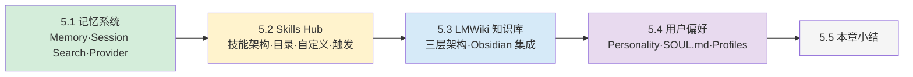

## 第五章：记忆与技能

### 章节引言

前一章你学会了把 Agent 部署到多个消息平台。但每次新对话，Agent 都是从零开始——它不记得你上次的偏好，不会复用之前总结的工作流，也无法回忆你们之前的讨论。

Hermes 的 **记忆与技能系统** 解决这个问题。它不是简单的对话历史保存，而是一个精心设计的三层持久化架构：

1. **Memory**：跨会话的稳定事实（用户偏好、环境信息、工具特性），每轮自动注入
2. **Skills**：可复用的程序化知识（复杂工作流、调试步骤、最佳实践），按需加载
3. **Session Search**：过去的完整对话记录，FTS5 全文搜索 + LLM 摘要

再加上 **LMWiki 知识库**（结构化的持久知识库）和 **用户偏好系统**（人格、Profiles），Hermes 的"记忆"远超单次对话的范畴。

**学习目标：**

- 理解 Memory 系统的三层架构：存储层 → 编排层 → 插件层
- 掌握 Memory 工具的使用：add/replace/remove
- 理解 Skills 的渐进式披露机制和自动创建/更新
- 掌握 LMWiki 知识库的 Ingest-Query-Lint 工作流
- 学会配置用户偏好、人格系统和多配置 Profiles

---

### 全景导览

本章五个节，围绕"让 Agent 拥有持久记忆和可进化能力"展开：

### 本章内容导读

- **[5.1 记忆系统](5.1_memory_system.md)**：MemoryStore 双文件存储、冻结快照、session_search FTS5 检索、MemoryProvider 插件
- **[5.2 Skills Hub](5.2_skills_hub.md)**：技能架构、SKILL.md 格式、`/skills` 浏览安装、条件激活、自动 Skill Review
- **[5.3 LMWiki 知识库](5.3_lmwiki.md)**：Karpathy 理念 vs RAG、三层架构、Ingest-Query-Lint、Obsidian 集成
- **[5.4 用户偏好](5.4_user_preferences.md)**：`/personality` 人格系统、SOUL.md / USER.md、Profiles 多配置
- **[5.5 本章小结](5.5_summary.md)**：三种持久化机制对比与自检清单
